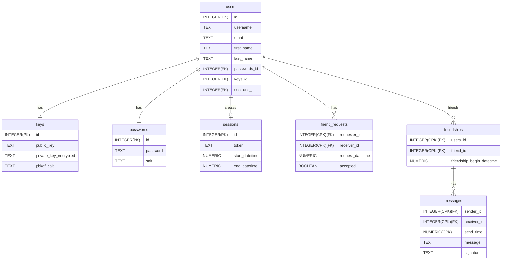

# Messenger

## About

This project is an encrypted messenger application that allows users to log in securely, add other users as friends, send messages to other users, and view messages sent to the logged in user all in real time.

## TODO

- [x] Configure project structure
- [x] Set up db schema
- [x] Configure environment
- [ ] Set up go integration with db

## Key Features

- [ ] Users can register for an account.
- [ ] Users can log in.
- [ ] Users can log out.
- [ ] Users can add others as friends.
- [ ] Users can send messages to other users.
- [ ] Users can view messages sent to them in real time.

## Key Technologies

- Backend logic will be done with Go
- Persistance will be done using a SQLite database

## Design

### Account Management Subsystem (AMS) - Registering for an account

The registration process will be relatively straight forward.  To register, the user will take these actions:

1. Provide name (first and last)
1. Provide username (must be unique in application store)
1. Provide email
1. Provide password

The first step of the registration process will be to check if the given username is valid.  A given username is valid if:

1. It is alphanumeric.
1. It does not already exist in the database.
1. Its length is less than or equal to 20 characters.

The rest of the fields are then validated trivially.  The password is then salted and hashed prior to being stored alongside its salt in the db.  They will also be issued a cryptographic keypair to be used for asymmetric encryption.

### AMS - Logging into an account

To log in, users will have to enter the following information:

1. Username
1. Password

After they enter their credentials, the provided password will be salted and hashed and checked against the stored password hash.  On successful login, the user will be provided a user access token that will be required for all future communications on the behalf of the logged in user.

### AMS - Logging out

The process of logging out will simply invalidate the user's active user token.

### Adding Friends

To add a user as a friend, the logged-in user will provide the username of the account they wish to add as a friend.  If the username is valid, the specified user will then be added to the logged-in user's friends list.

### Sending Messages

The user can send messages to other users they have added as friends.  They will specify the user they wish to communicate with which will then open a live chat with the specified user.  All messages will be end-to-end encrypted and signed.  For this project, we will assume the server host has some TCB on which the keystore is located.

### Realtime Messaging

The realtime element of this messaging system is handled using a custom request-response protocol similar to HTTP.  To avoid having active connections through sockets or requiring polling of a db, when the server receives a message from a user, the receiving user is then sent a message directly from the server if they have an active session.  If they do not have an active session, the message is just persisted.  __NOTE__: encrypted messages are persisted even if the user is active so that they can view their history at a later date.

## Database Model

